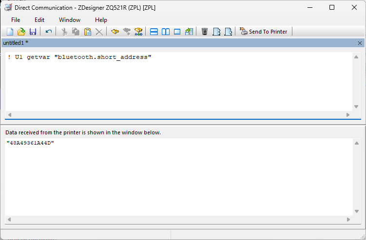
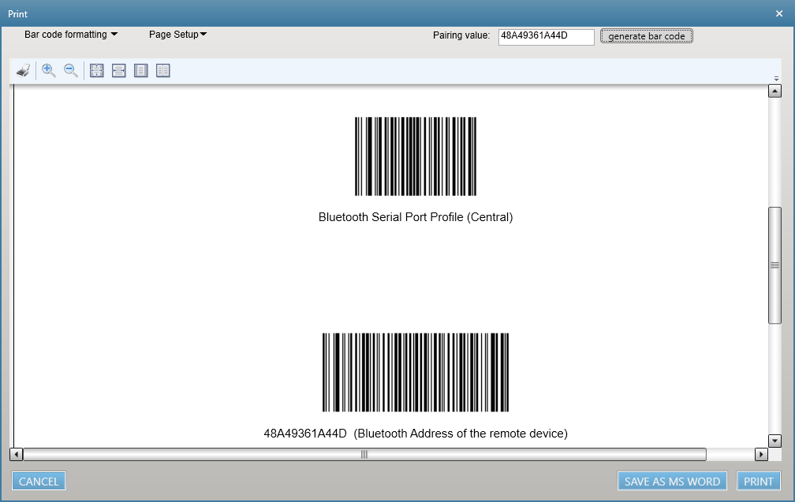

1. Zebra Setup Utilities for Windowsを起動する。

1. プリンタのbluetooth 設定を変更する。

        ! U1 setvar "bluetooth.discoverable" "on"
        ! U1 setvar "bluetooth.enable" "on"
        ! U1 setvar "bluetooth.minimum_security_mode" "1"

1. プリンタを再起動する。

1. プリンタのbluetoothをMACアドレスを確認する。

        ! U1 getvar "bluetooth.short_address"
        "48A49361A44D" ★
    ★ 以降はMACアドレスが"48A49361A44D"を例に解説。

    

1. Windows PCに123Scanをインストールする。

1. 123 Scanを起動する。

1. [Barcodes] > [Bluetooth Barcodes] > [Serial Port Profile (central) pairing barcode] を選択。

1. [Pairing value]に取得したbluetooth.short_address値を入れる。

1. [Generate Barcode Code] を選択。

1. 設定甩バーコードが作成されるので、下記バーコードを順にスキャンする。

    1. Bluetooth Serial Port Profile (Central)
    2. xxxxxxxx (Bluetooth Address of the remote device)

1. プリンタとのBluetooth接続を確認する。  
    ※ 初回の場合は確認処理が必要な場合がある。

1. 下記バーコードをRS5100でスキャンする。正常に接続ができている場合、プリンタから設定ラベル（ZPLプリンタ用）が印刷される。

    

